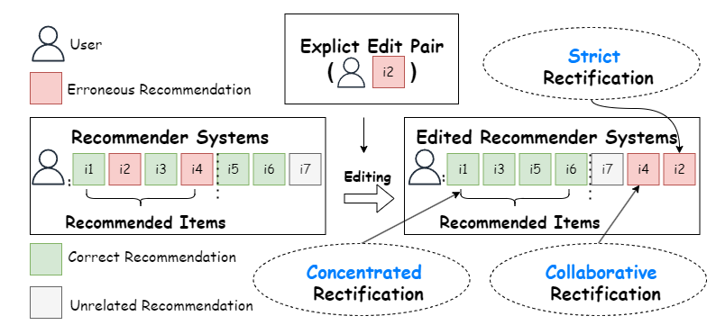
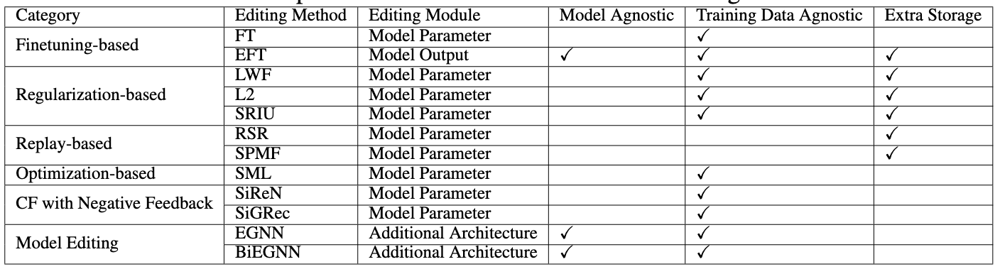

# Recommendation Editing
The goal of recommendation editing is to quickly correct the erroneous recommendations of the recommendation system, thereby improving the user-friendliness of the recommendation system. For example, in the real-time re-ranking stage of industrial-level multi-stage recommendation systems, the recommendation system needs to perform real-time editing based on the negative feedback provided by users in real time, reducing the occurrence of negative feedback behavior in the recommended results of the next refresh.
For more detailed information on Recommendation Editing, please refer to our paper:[Better Late Than Never: Formulating and Benchmarking Recommendation Editing](https://arxiv.org/abs/2406.04553).

<div align="center">

</div>

## 🚀Quick Start

### Clone
```
git clone git@github.com:cycl2018/Recommendation-Editing.git
```
### Set up the required environment
```
numba==0.58.1
numpy==1.26.3
scipy==1.12.0
torch==2.1.0+cu121
```
### Train the original recommendation model (if you directly use the checkpoint we provide, you can skip it)
- Example of training XSimGCL model by KuaiRand dataset.
- You can refer to the files in the/conf folder for configuration
```
python train.py --conf conf/XSimGCL/KuaiRand.conf
```
### Editing
Some important parameters:
- --model_conf: The configuration file of the original model.
- --best_param: Running with optimal parameters(You can reproduce the results in Table 2 of the paper by using the best parameter).
- --edit_type: The Editing method you want to use.
- --edit_num: The number of times the Editing task is run.
<br>
If you don't want use best_param， you can set the following parameters by yourself.

- --edit_lr: The learning rate in editing stage.
- --edit_loss: The edit objective you want use，like 'bpr' or 'bce.(The 'bpr' represents our proposed editing BPR loss).
- --model: The model you want edit.
- --dataset: The dataset you want use.

<br>
Example of editing XSimGCL model by FT method.

```
python edit.py --model_conf conf/XSimGCL/KuaiRand.conf --edit_type FT --best_param --edit_num 10
```
## Comparison of different recommendation editing methods.
<div align="center">

</div>

## Acknowledgments
We are grateful to the authors of 
[SELFRec](https://github.com/Coder-Yu/SELFRec) 
for making their project codes publicly available.

## Citation
<!-- Our paper on this benchmark will be released soon! -->

If you use our benchmark in your works, we would appreciate citations to the paper:

```bibtex
@article{lai2024better,
  title={Better Late Than Never: Formulating and Benchmarking Recommendation Editing},
  author={Lai, Chengyu and Zhou, Sheng and Jiang, Zhimeng and Tan, Qiaoyu and Bei, Yuanchen and Chen, Jiawei and Zhang, Ningyu and Bu, Jiajun},
  journal={arXiv preprint arXiv:2406.04553},
  year={2024}
}
```
